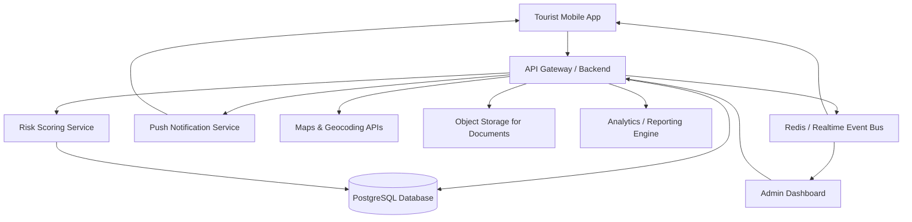
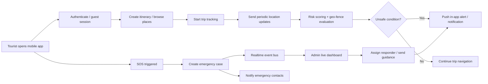

# System Architecture

## 1. High-Level Architecture

## 2. Core Components

### Tourist Mobile App

Primary modules:
- Authentication and onboarding
- Trip planner
- Safe navigation map
- Alerts center
- SOS and panic mode
- Incident reporting
- Nearby emergency services
- Secure document vault
- Offline emergency information

### Admin Dashboard

Primary modules:
- Admin authentication and RBAC
- Live operations map
- SOS and incident console
- Unsafe zone and broadcast management
- Travel data/content management
- Analytics and response metrics
- Audit logs and admin action history

### Backend Platform

Suggested services for an MVP-friendly architecture:
- **Auth service:** login, tokens, refresh, role validation
- **Trip service:** itineraries, saved places, travel content
- **Safety service:** unsafe zones, risk scores, geo-fence logic
- **Emergency service:** SOS events, incident case management, responder simulation
- **Location service:** live tracking, check-ins, route metadata
- **Notification service:** push alerts, SMS/email fallbacks, in-app notifications
- **Document service:** encrypted file metadata and secure retrieval
- **Analytics service:** incident heatmaps, trend summaries, admin KPIs

## 3. Recommended Architecture Style

For a hackathon, use a **modular monolith** with clear domain boundaries instead of many separate deployable microservices. This keeps deployment simple while preserving startup-ready structure.

- One backend application with domain modules.
- PostgreSQL for core relational data.
- Redis or managed realtime channels for SOS and live map updates.
- Firebase Cloud Messaging or OneSignal for push notifications.
- Mapbox, Google Maps, or OpenStreetMap-based routing for navigation.
- Object storage such as S3, Supabase Storage, or Firebase Storage for document vault assets.

## 4. System Data Flow

## 5. Detailed Module Responsibilities

### 5.1 Tourist app module design

1. **Onboarding & Profile**
   - Register/login
   - Language selection
   - Emergency contacts
   - Consent settings
2. **Travel Planner**
   - Search destination places
   - View fees, timings, and local tips
   - Save itinerary items
3. **Safe Navigation**
   - Request route from current location to destination
   - Overlay unsafe zones and alerts
   - Recalculate safer path if needed
4. **Safety Center**
   - View alerts, advisories, and check-ins
   - Area safety score
   - Nearby emergency services
5. **Emergency Center**
   - SOS button
   - Panic mode
   - Incident reporting form
   - Location sharing status
6. **Document Vault**
   - Upload encrypted documents
   - View metadata offline if files are not downloadable
7. **Offline Support**
   - Cache itinerary, help contacts, and safety instructions
   - Queue unsent reports and sync later

### 5.2 Admin dashboard module design

1. **Operations Overview**
   - Current active trips
   - Active SOS alerts
   - Unresolved incidents
2. **Map & Monitoring**
   - Tourist pins
   - Unsafe zone overlays
   - Incident heatmap
3. **Case Management**
   - Open, assign, escalate, resolve incidents
   - Attach notes and action timeline
4. **Zone Management**
   - Draw/edit polygons
   - Set severity, effective time, and alert text
5. **Broadcast Center**
   - Push targeted or city-wide alerts
6. **Content Management**
   - Manage tourist places, support centers, emergency directory, and local travel guidance
7. **Analytics**
   - Incident trends by category, hour, and area
   - Alert open rates
   - Average response time

## 6. Login and Access Design

### Tourist
- Login is required for personalized safety, document vault, emergency contacts, and trip continuity.
- Guest users can browse destinations and static safety data but cannot use SOS escalation workflows tied to identity.

### Admin
- Login is mandatory.
- Use role-based access control:
  - `super_admin`
  - `operations_admin`
  - `analyst`
  - `content_manager`
- Require MFA for privileged users if possible.

## 7. Realtime Design

- Location updates every 15-30 seconds during active navigation or panic mode.
- WebSocket or Socket.IO channel for:
  - live tourist markers
  - SOS events
  - incident updates
  - admin broadcast acknowledgements
- Rate limit and throttle location writes to reduce battery and backend load.

## 8. Risk Zone Detection Logic

Risk score can be calculated from:
- admin-tagged unsafe zones
- time-based risk windows
- recent incident density
- simulated crowd/event markers
- user-defined concern types such as solo travel or night travel

Example score bands:
- `0-30`: low risk
- `31-60`: medium risk
- `61-100`: high risk

## 9. Security Architecture

- JWT access tokens and rotating refresh tokens.
- Hashed passwords or delegated identity provider login.
- TLS for all client-server communication.
- Encryption at rest for sensitive document metadata and emergency details.
- Signed URLs for temporary document access.
- Fine-grained admin RBAC with audit logs.
- Explicit consent flows for location sharing.
- Data minimization: location stored at lower precision after trip completion unless incident-related.

## 10. Deployment Blueprint

### Hackathon deployment
- **Mobile app:** Expo/React Native build or Flutter build.
- **Admin dashboard:** Vercel or Netlify.
- **Backend:** Render, Railway, Fly.io, or a small cloud VM.
- **Database:** Supabase PostgreSQL, Neon, or Railway Postgres.
- **Storage:** Supabase Storage / S3.
- **Push:** Firebase Cloud Messaging.

### Production evolution
- Separate realtime pipeline.
- Add regional routing and geospatial indexing.
- Add external feeds for government alerts and verified incident sources.
