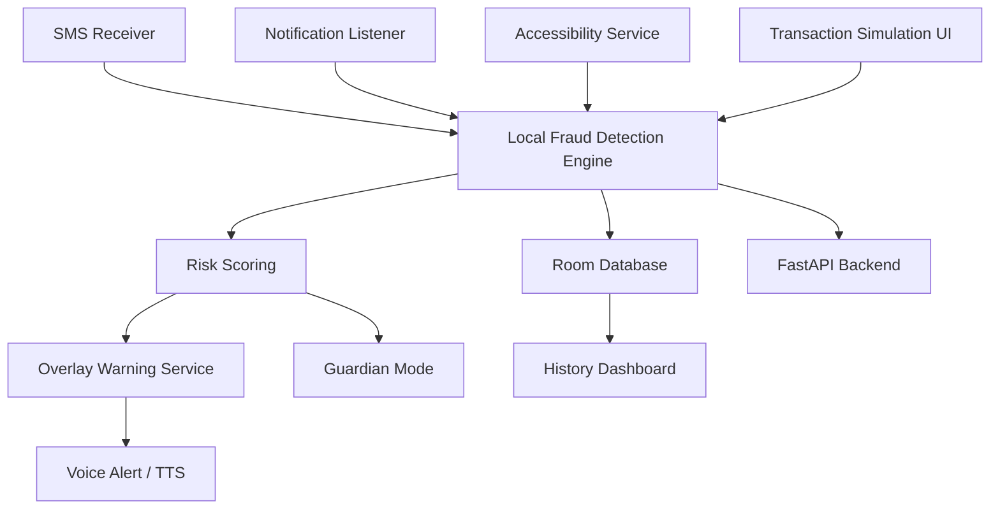
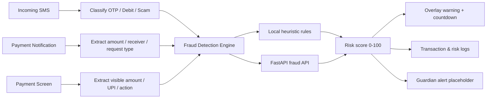

# System Architecture

## High-Level Components

## Data Flow Diagram

## Android Service Design

- **SMS Receiver** parses OTP timing, amount, suspicious keywords, and short links.
- **Notification Listener** detects collect requests, autopay prompts, and transaction alerts.
- **Accessibility Service** monitors supported payment apps and inspects visible text for amount, UPI ID, and pay/confirm buttons.
- **Overlay Service** draws a warning banner over payment apps using `SYSTEM_ALERT_WINDOW`.
- **Voice Alert System** uses Android `TextToSpeech` to speak a concise scam warning.

## Fraud Detection Algorithm

1. Build a `PaymentEvent` from SMS, notification, accessibility, or simulation input.
2. Load local context:
   - Average transaction amount
   - Recent transaction velocity
   - Known contacts
   - Local blacklist
3. Apply heuristic scoring rules:
   - unusual amount
   - unknown receiver
   - scam keywords
   - suspicious links
   - late-night behavior
   - repeated transactions
   - blacklist hit
   - OTP-before-payment context
   - collect request or autopay flow
4. Call backend API for an additional rule-based opinion.
5. Take the maximum of local and backend score.
6. Map score to levels:
   - `0-30` Safe
   - `31-60` Suspicious
   - `61-100` High Risk
7. Log the result and trigger overlay for suspicious/high-risk cases.

## Android Permissions Explained

- `READ_SMS`: reads payment-related messages and OTPs for scam context.
- `RECEIVE_SMS`: receives incoming SMS broadcasts immediately.
- `BIND_NOTIFICATION_LISTENER_SERVICE`: allows the notification listener to observe collect requests and payment alerts after the user enables access.
- `BIND_ACCESSIBILITY_SERVICE`: allows the accessibility service to inspect visible payment-screen content after explicit enablement.
- `SYSTEM_ALERT_WINDOW`: draws the overlay warning above payment apps.
- `INTERNET`: sends transaction context to the FastAPI risk API.
- `FOREGROUND_SERVICE`: keeps protection services alive during monitoring.
- `RECEIVE_BOOT_COMPLETED`: restarts protection after device reboot.
- `USE_BIOMETRIC`: reserved for secure settings, guardian approval, and future protected overrides.

## How the Overlay Works

1. Risk engine detects a suspicious payment attempt.
2. `OverlayProtectionService` launches in foreground mode.
3. `OverlayController` inflates `overlay_warning.xml`.
4. The overlay shows score, reasons, countdown, and large action buttons.
5. Text-to-speech announces: *This transaction may be a scam. Please verify before proceeding.*

## Limitations

- Cannot directly access bank APIs or private payment provider internals.
- Cannot intercept or cancel real UPI settlement at the bank layer.
- Depends on visible UI text, SMS content, and notifications.
- Android OEM policies may restrict background behavior.
- MVP is rule-based and intentionally explainable for a hackathon.
