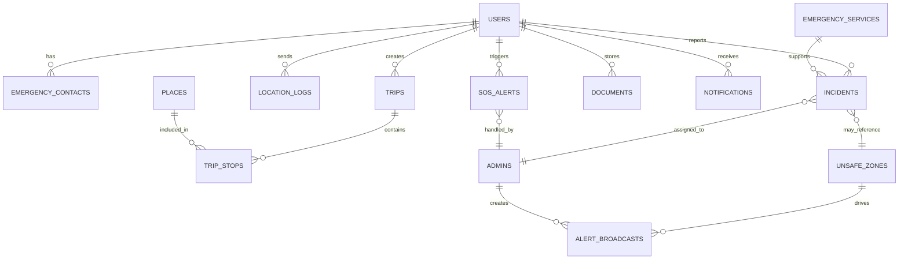

# Database Schema

## 1. Design Principles

The schema is optimized for a hackathon MVP while still modeling the main startup domains:
- identity and access
- trip planning
- live safety monitoring
- incidents and SOS management
- emergency services and content
- document protection

PostgreSQL is recommended because it supports relational integrity, JSON fields, and geospatial extensions via PostGIS if needed.

## 2. Core Entities and Relationships

## 3. Suggested Tables

### 3.1 `users`
| Column | Type | Notes |
|---|---|---|
| id | uuid pk | primary key |
| full_name | varchar | tourist name |
| email | varchar unique | optional if phone login used |
| phone | varchar unique | optional if email login used |
| password_hash | varchar | nullable when using OAuth/Firebase |
| preferred_language | varchar(10) | e.g. en, hi, fr |
| nationality | varchar | useful for assistance and embassy info |
| avatar_url | text | optional |
| auth_provider | varchar | local, firebase, google, apple |
| is_verified | boolean | account trust marker |
| created_at | timestamptz | |
| updated_at | timestamptz | |

### 3.2 `admins`
| Column | Type | Notes |
|---|---|---|
| id | uuid pk | |
| full_name | varchar | |
| email | varchar unique | |
| password_hash | varchar | or SSO mapping |
| role | varchar | super_admin, operations_admin, analyst, content_manager |
| last_login_at | timestamptz | |
| is_active | boolean | |
| created_at | timestamptz | |

### 3.3 `emergency_contacts`
| Column | Type | Notes |
|---|---|---|
| id | uuid pk | |
| user_id | uuid fk users.id | owner |
| name | varchar | |
| relation | varchar | friend, family, colleague |
| phone | varchar | |
| email | varchar | optional |
| priority_order | int | contact sequence |
| created_at | timestamptz | |

### 3.4 `trips`
| Column | Type | Notes |
|---|---|---|
| id | uuid pk | |
| user_id | uuid fk users.id | |
| title | varchar | e.g. Jaipur weekend |
| city | varchar | destination city |
| country | varchar | |
| start_date | date | |
| end_date | date | |
| status | varchar | planned, active, completed, cancelled |
| notes | text | |
| created_at | timestamptz | |

### 3.5 `trip_stops`
| Column | Type | Notes |
|---|---|---|
| id | uuid pk | |
| trip_id | uuid fk trips.id | |
| place_id | uuid fk places.id | optional if custom stop |
| custom_name | varchar | custom stop support |
| planned_visit_time | timestamptz | |
| visit_order | int | |
| notes | text | |

### 3.6 `places`
| Column | Type | Notes |
|---|---|---|
| id | uuid pk | |
| category | varchar | attraction, hotel, restaurant, exchange, help_center |
| name | varchar | |
| description | text | |
| address | text | |
| latitude | numeric | |
| longitude | numeric | |
| opening_hours | jsonb | structured timing info |
| entry_fee | numeric | optional |
| price_band | varchar | budget, mid, premium |
| rating | numeric | cached/curated rating |
| is_featured | boolean | |
| created_by_admin_id | uuid fk admins.id | |

### 3.7 `location_logs`
| Column | Type | Notes |
|---|---|---|
| id | uuid pk | |
| user_id | uuid fk users.id | |
| trip_id | uuid fk trips.id | nullable |
| latitude | numeric | |
| longitude | numeric | |
| accuracy_meters | numeric | |
| battery_level | int | optional safety context |
| source_mode | varchar | normal, navigation, panic_mode, check_in |
| recorded_at | timestamptz | |

### 3.8 `unsafe_zones`
| Column | Type | Notes |
|---|---|---|
| id | uuid pk | |
| title | varchar | |
| zone_type | varchar | theft, protest, crowd, flood, curfew |
| severity | int | 1-5 |
| polygon_geojson | jsonb | geo-fence polygon |
| active_from | timestamptz | |
| active_until | timestamptz | |
| safety_advice | text | |
| status | varchar | active, expired, draft |
| created_by_admin_id | uuid fk admins.id | |
| created_at | timestamptz | |

### 3.9 `incidents`
| Column | Type | Notes |
|---|---|---|
| id | uuid pk | |
| user_id | uuid fk users.id | reporter |
| trip_id | uuid fk trips.id | nullable |
| unsafe_zone_id | uuid fk unsafe_zones.id | nullable |
| category | varchar | theft, harassment, medical, suspicious_activity, traffic |
| severity | int | 1-5 |
| description | text | |
| latitude | numeric | |
| longitude | numeric | |
| media_urls | jsonb | optional attachments |
| status | varchar | open, acknowledged, assigned, resolved |
| assigned_admin_id | uuid fk admins.id | nullable |
| created_at | timestamptz | |
| resolved_at | timestamptz | nullable |

### 3.10 `sos_alerts`
| Column | Type | Notes |
|---|---|---|
| id | uuid pk | |
| user_id | uuid fk users.id | |
| trip_id | uuid fk trips.id | nullable |
| incident_id | uuid fk incidents.id | nullable link if converted |
| trigger_method | varchar | button, shake, voice, auto_checkin_fail |
| status | varchar | active, acknowledged, escalated, closed |
| latitude | numeric | |
| longitude | numeric | |
| last_location_at | timestamptz | |
| assigned_admin_id | uuid fk admins.id | nullable |
| created_at | timestamptz | |
| closed_at | timestamptz | nullable |

### 3.11 `notifications`
| Column | Type | Notes |
|---|---|---|
| id | uuid pk | |
| user_id | uuid fk users.id | nullable for broadcast fan-out models |
| type | varchar | alert, broadcast, sos_update, checkin_reminder |
| title | varchar | |
| message | text | |
| channel | varchar | push, sms, email, in_app |
| is_read | boolean | |
| metadata | jsonb | deep-link/context |
| sent_at | timestamptz | |

### 3.12 `alert_broadcasts`
| Column | Type | Notes |
|---|---|---|
| id | uuid pk | |
| created_by_admin_id | uuid fk admins.id | |
| target_type | varchar | zone, city, trip_segment, all |
| target_reference | varchar | zone id, city code, or all |
| title | varchar | |
| message | text | |
| severity | varchar | info, warning, critical |
| scheduled_at | timestamptz | |
| sent_at | timestamptz | nullable |

### 3.13 `documents`
| Column | Type | Notes |
|---|---|---|
| id | uuid pk | |
| user_id | uuid fk users.id | |
| document_type | varchar | passport, visa, id_card, ticket, insurance |
| file_url | text | encrypted object path |
| file_name | varchar | |
| mime_type | varchar | |
| file_size_bytes | bigint | |
| encryption_key_ref | varchar | KMS or provider key reference |
| uploaded_at | timestamptz | |

### 3.14 `emergency_services`
| Column | Type | Notes |
|---|---|---|
| id | uuid pk | |
| service_type | varchar | police, hospital, embassy, help_center |
| name | varchar | |
| address | text | |
| phone | varchar | |
| latitude | numeric | |
| longitude | numeric | |
| operating_hours | jsonb | |
| city | varchar | |
| is_verified | boolean | admin-curated flag |

### 3.15 `audit_logs`
| Column | Type | Notes |
|---|---|---|
| id | uuid pk | |
| admin_id | uuid fk admins.id | |
| action | varchar | |
| entity_type | varchar | zone, incident, user, broadcast |
| entity_id | uuid | |
| before_state | jsonb | optional |
| after_state | jsonb | optional |
| created_at | timestamptz | |

## 4. Key Relationships Explained

- One `user` can have many `emergency_contacts`, `trips`, `incidents`, `sos_alerts`, `documents`, and `location_logs`.
- A `trip` contains many `trip_stops`, which may reference curated `places`.
- `unsafe_zones` are created by admins and may influence route safety, geo-fence alerts, and incident analytics.
- `incidents` and `sos_alerts` can be assigned to an `admin` for response tracking.
- `notifications` represent both direct alerts and updates related to incidents or broadcasts.
- `audit_logs` preserve privileged admin actions for security and accountability.

## 5. Geospatial Notes

If PostGIS is enabled, replace plain latitude/longitude pairs with:
- `geography(Point, 4326)` for live points and services
- `geography(Polygon, 4326)` for unsafe zones

This improves:
- nearby service lookup
- zone containment checks
- safer route analysis
- heatmap generation
